# SymbolicHEC: Minimum-Parameter Symbolic Patterns of Hand-Eye Calibration Variants: Analysis and Efficient Solvers

## Authors
Jin Wu, Chaoqun Wang, Jieqi Shi, Yulong Huang*, Jiwen Lu, Wei He

University of Science and Technology Beijing, China

E-mail: wujin@ustc.edu.cn (Wu, Jin); heuedu@163.com (Huang, Yulong; Corresponding Author)

## Introduction
This repository is a CMake/C++ package for hand-eye / robot-world calibration of the form

$$
A_i X = Y B_i, \qquad X, Y \in \mathrm{SE}(3).
$$

It packages the reduced symbolic templates, the runtime linear-system solvers, loop-testing tools, benchmarking tools, and real-world dataset runners needed to evaluate the minimum-parameter globally optimal calibration pipeline described in the accompanying IJRR paper. The same algebraic core appears in industrial robot hand-eye calibration, robot-world alignment, rigid stereo calibration, and broader multi-sensor frame-registration problems.

This package provides four standalone executables:

- `test_AXYB_grobner_solver` 
- `test_AXYB_grobner_solver_loop` 
- `benchmark_AXYB_linear_backends` to time `solve_template_system()` across all linear-system backends
- `run_rw_multi_eye_multi_hand` to process the certifiable-rwhe-calibration real-world tag/camera datasets with the current C++ AXYB solver

The generated Gröbner templates are stored as compact binary `.tpl` files under `data/templates`.

## Theory Overview

<p align="center">
  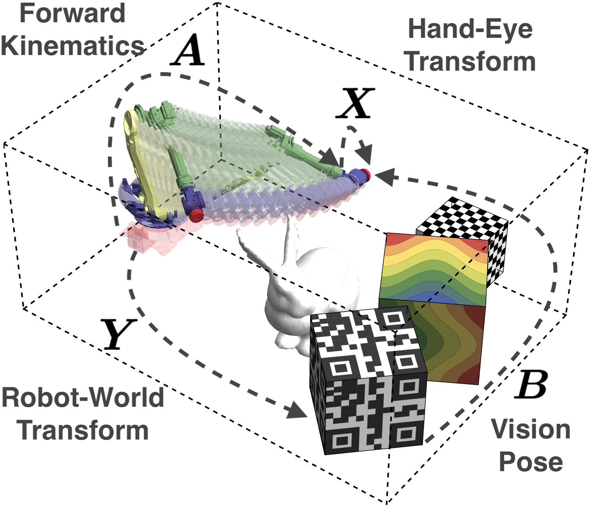
  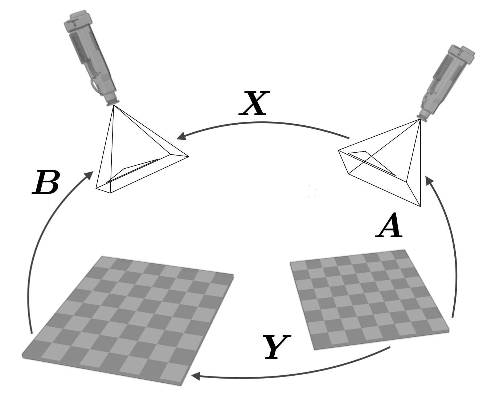
</p>

The project follows the hand-eye/robot-world calibration (HERWC) formulation in which each measurement pair contributes one rigid-body equation

$$
A_i X = Y B_i.
$$

Here `A_i` and `B_i` are measured `SE(3)` transforms, while `X` and `Y` are the unknown rigid transforms to be estimated. Depending on the application, `X` can represent the hand-eye transform and `Y` the robot-world transform, or `X` can be an inter-camera transform while `Y` captures the rigid relation between calibration targets. This is why the same equation appears in both robot-camera calibration and non-overlapping camera calibration.

Writing each pose as

$$
X =
\begin{bmatrix}
R_X & t_X \\
0 & 1
\end{bmatrix},
\qquad
Y =
\begin{bmatrix}
R_Y & t_Y \\
0 & 1
\end{bmatrix},
$$

the least-squares objective becomes

$$
\min_{X,Y \in \mathrm{SE}(3)} \sum_{i=1}^{\mathcal N} \left\| A_i X - Y B_i \right\|_F^2,
$$

with rotation and translation parts

$$
R_{A,i} R_X = R_Y R_{B,i},
$$

$$
R_{A,i} t_X + t_{A,i} = R_Y t_{B,i} + t_Y.
$$

The difficulty is that this is a nonlinear, non-convex problem over two unknown poses. A direct formulation keeps 12 pose variables, mixes rotation and translation scales, and hides the lower-dimensional algebraic structure that the symbolic solver can exploit.

## Minimum-Parameter Reduction

<p align="center">
  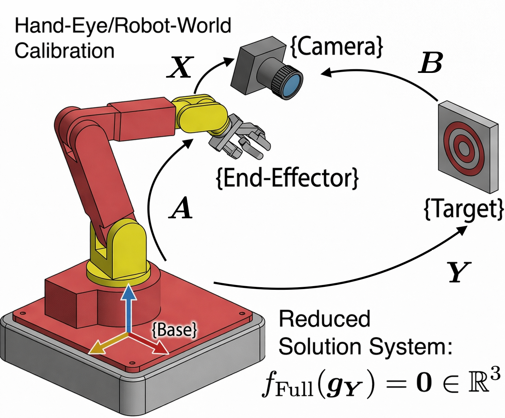
</p>

The key theoretical observation behind this codebase is that, once the relevant rotations are fixed, the translational residuals are linear in the unknown translations. That means the translation block can be eliminated analytically before solving the remaining nonlinear problem.

For HERWC, the translation-only objective is

$$
\min_{R_Y \in \mathrm{SO}(3),\, t_X,t_Y \in \mathbb{R}^3}
\sum_{i=1}^{\mathcal N}
\left\|
R_{A,i} t_X + t_{A,i} - R_Y t_{B,i} - t_Y
\right\|^2.
$$

The paper shows that the optimal `t_X` and `t_Y` are analytic functions of `R_Y`. After substitution, the pure-translation problem is reduced from two full `SE(3)` poses to only the three rotational degrees of freedom of `R_Y`. In the paper this reduced form is interpreted as a quadratic pose-estimation problem (QPEP): the translations are no longer optimized independently, but recovered from the reduced rotational variable.

For the complete HERWC problem, the solver uses Cayley coordinates for the rotations. A rotation is parameterized by a 3-vector `g` through

$$
R(g) =
\frac{
\left(1 - g^\top g\right) I + 2[g]_\times + 2 g g^\top
}{
1 + g^\top g
}.
$$

This converts the rotational unknowns into unconstrained Euclidean variables `g_X` and `g_Y`. After clearing denominators and eliminating translations, the full problem is turned into a polynomial stationarity system in six variables. The Gröbner templates shipped in this repository are generated from that reduced system.

This same reduction logic also explains why the classical hand-eye problem

$$
A_i X = X B_i
$$

is the constrained case `X = Y` of HERWC: after eliminating translation, it reduces from six pose parameters to only the three rotational parameters of `X`. The paper further extends the same elimination pattern to the more general tool-flange problem `A X B = Y C Z`, although this repository is centered on the `AX=YB` branch and its generated templates.

## From Paper to Code

<p align="center">
  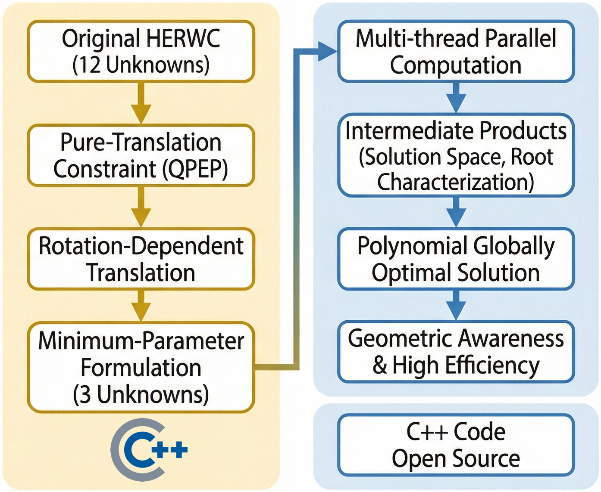
</p>

The implementation here follows that symbolic pipeline closely:

1. paired `SE(3)` measurements are assembled into the reduced HERWC equations;
2. the symbolic system is encoded as elimination templates;
3. the templates are solved through structured linear algebra;
4. candidate roots are recovered and scored by the original calibration objective.

In practice, that mapping shows up in the repository as:

- `data/templates/AXYB_complete_x1.tpl` through `AXYB_complete_x6.tpl`: binary elimination templates generated from the reduced polynomial systems.
- `src/generated_symbolics.cpp` and `include/axyb/generated_symbolics.hpp`: converted symbolic support code.
- `test_AXYB_grobner_solver`: solve one synthetic instance and evaluate candidate templates.
- `test_AXYB_grobner_solver_loop`: generate or replay many synthetic problems and summarize performance.
- `benchmark_AXYB_linear_backends`: isolate the structured linear-solver portion of the Gröbner pipeline.
- `run_rw_multi_eye_multi_hand`: apply the current solver to the real-world tag/camera datasets from `certifiable-rwhe-calibration`.

The Julia examples under `certifiable-rwhe-calibration/examples` complement the C++ solver with certifiable SDP-based formulations and file-driven evaluation scripts, while this top-level project focuses on the converted Gröbner-template runtime.

## Julia Examples And Implementation Details

The `certifiable-rwhe-calibration` subproject provides a second implementation path for the same `A_i X = Y B_i` problem, but instead of using pre-generated Gröbner templates it forms a robot-world calibration cost matrix and solves a certifiable semidefinite relaxation through JuMP. This makes the Julia scripts useful both as reference implementations and as cross-checks against the C++ solver.

To run the Julia examples, enter the subproject and instantiate its environment once:

```bash
cd certifiable-rwhe-calibration
julia --project=. -e 'using Pkg; Pkg.instantiate()'
```

All three example scripts are intentionally lightweight wrappers around the same core source files:

- `src/calibration/robot_world_costs.jl`: builds the sparse robot-world transformation cost from stacked `SE(3)` measurements.
- `src/rotation_sdp_solver_jump.jl`: solves the dual SDP with JuMP and recovers a pose solution from the dual certificate.
- `src/utils/rotation_noise.jl`: used by the noise-sweep example to perturb rotations with controlled angular noise.

At a high level, each Julia example follows the same computational pattern:

1. prepare or load measurement arrays `A` and `B` with shape `(num_pairs, 4, 4)`;
2. set unit weights for the rotational and translational residual blocks;
3. form the cost matrix with `sparse_robot_world_transformation_cost(A, B, weights, weights)`;
4. solve the dual SDP with `solve_sdp_dual_jump(Q, 2, true, true)`;
5. recover `X` and `Y` from `extract_solution_from_dual(Z)`;
6. compare the estimate to ground truth or summarize the residual statistics.

In other words, the Julia examples do not hide the solver behind a large framework. They show the concrete path from raw `SE(3)` measurements to the cost matrix, dual solve, pose extraction, and residual/error reporting.

### `solve_axyb_multiple_pairs.jl`

Run:

```bash
julia --project=. examples/solve_axyb_multiple_pairs.jl
```

This is the smallest end-to-end Julia example. It:

- synthesizes one clean calibration problem with 6 measurement pairs;
- plants fixed ground-truth transforms `X_gt` and `Y_gt`;
- generates consistent measurements satisfying `A_i X = Y B_i`;
- solves the resulting SDP once;
- prints the ground-truth and estimated poses, plus the maximum rotation and translation residuals.

Use this script when you want the clearest possible reference for how the Julia solver is wired together.

### `solve_axyb_noise_sweep.jl`

Run:

```bash
julia --project=. examples/solve_axyb_noise_sweep.jl --loops 5 --pairs 6 --noises 0.0,0.01,0.03
```

This script evaluates robustness and efficiency over many synthetic trials. It:

- accepts CLI options `--loops`, `--pairs` or `--num-pairs`, and `--noises`;
- regenerates random clean `AX=YB` problems, then perturbs both `A` and `B`;
- uses the same noise scalar as rotation-angle standard deviation in radians and translation standard deviation;
- times the full Julia solving path, including weight construction, `sparse_robot_world_transformation_cost(...)`, and `solve_sdp_dual_jump(...)`;
- counts a trial as solved only when the JuMP termination status is exactly `OPTIMAL`;
- prints a summary table for each noise level.

The output table reports:

- noise level;
- solved count;
- mean rotation and translation errors for `X`;
- mean rotation and translation errors for `Y`;
- mean residuals of `A_i X - Y B_i`;
- mean solve time in milliseconds.

This is the right script when you want the README-level equivalent of a synthetic benchmark or ablation sweep.

### `solve_axyb_input_file.jl`

Run:

```bash
julia --project=. examples/solve_axyb_input_file.jl --input_meas /path/to/loop_meas.txt
```

Optional:

```bash
julia --project=. examples/solve_axyb_input_file.jl \
  --input_meas /path/to/loop_meas.txt \
  --success_tol 1e-2
```

This script connects the Julia solver to stored measurement files instead of random synthesis. It:

- parses the `AXYB_LOOP_MEAS_V1` text format used by the C++ loop runner;
- reads every problem in the file rather than a single selected case;
- extracts ground-truth `X0` and `Y0` together with every stored `A` and `B` sequence;
- solves each problem independently with the SDP pipeline;
- marks a problem as successful only when the solver status is `OPTIMAL` and both pose errors are below `--success_tol`;
- prints one summary row per problem and then aggregates totals at the end.

The per-problem table includes:

- problem index and sequence length;
- solver status;
- ground-truth and estimated objective values;
- pose error for `X`;
- pose error for `Y`;
- solve time in milliseconds;
- final `successful` flag.

This example is especially useful when comparing the Julia certifiable solver against datasets generated by the C++ executables such as `test_AXYB_grobner_solver_loop --output_meas ...`.

## Why The Linear Backends Matter

<p align="center">
  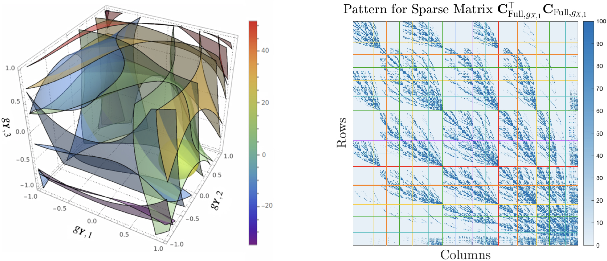
</p>

Minimum-parameter reduction shrinks the conceptual optimization dimension, but the resulting elimination templates can still be large. The paper emphasizes that these templates should not be treated as monolithic dense systems. Their monomial structure admits segmentation into blocks associated with retained monomials, eliminated monomials, and action variables. That observation is the reason this repository invests heavily in backend selection and oneTBB parallelism.

The C++ implementation mirrors that idea in two ways:

- it stores the generated templates in compact binary form rather than reconstructing dense symbolic systems at runtime;
- it exposes multiple dense, sparse, and iterative linear-system backends so the template solve can be tuned for memory use, throughput, and numerical behavior.

The benchmark executable exists precisely because solver efficiency in this project is often dominated by the structured linear solves inside template reduction, not by the surrounding command-line scaffolding.

### Large Elimination Templates

<p align="center">
  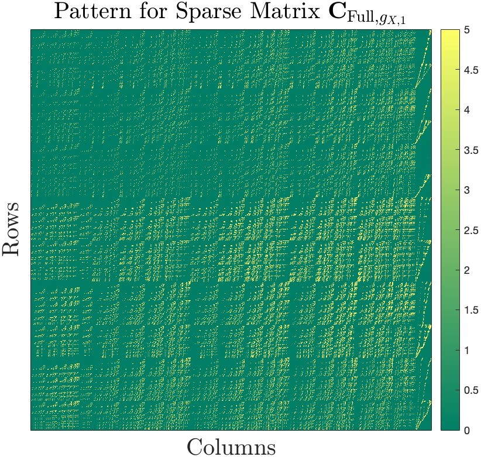
  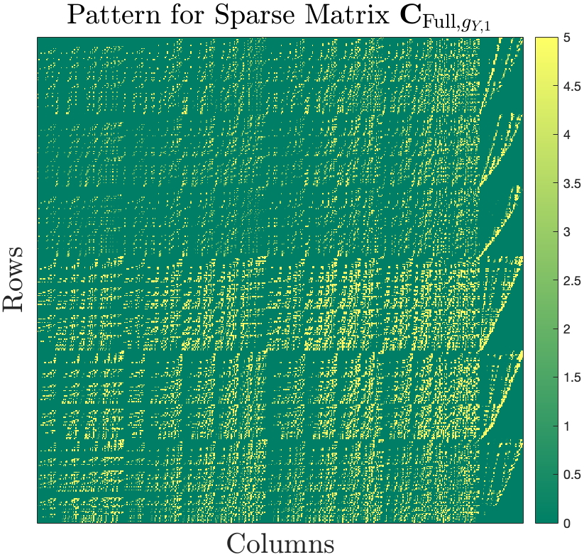
</p>

For the complete HERWC solver, the elimination template can become genuinely large. The paper reports sparse template matrices `C` of size `6991 x 6991` for one action-monomial choice and `4343 x 4343` for another. These are not toy symbolic systems: they are the concrete linear algebra objects that the Gröbner pipeline must reduce in order to construct action matrices and recover candidate roots.

<p align="center">
  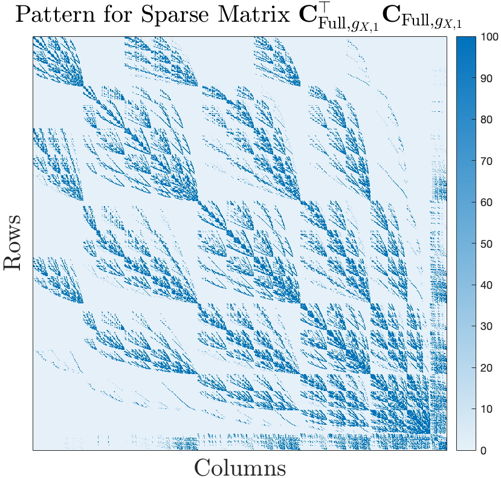
  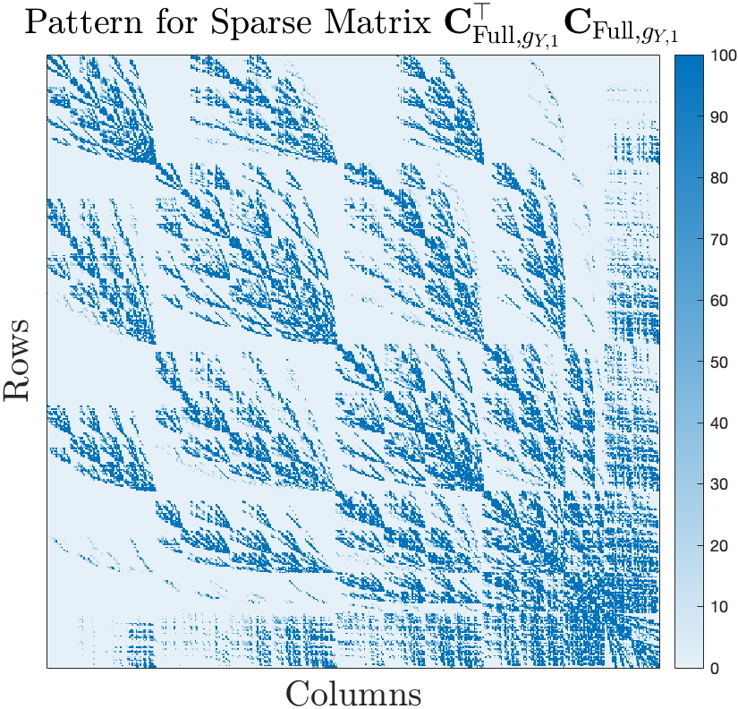
</p>

The normal-equation forms `CᵀC` remain large and sparse, with repeated support patterns rather than dense fill everywhere. This is one of the main reasons the repository exposes multiple backend choices instead of assuming a single dense direct solve is always appropriate. The matrix-geometry figures make the paper’s point visually: minimum-parameter reduction lowers the optimization dimension, but it still leaves a serious structured linear-system problem to solve efficiently.

### Parallelized Linear-System Solving

<p align="center">
  
  
</p>

The right panel of the first figure shows the departition strategy used for the elimination template: rows and columns are grouped into blocks associated with retained monomials, eliminated monomials, and action variables. The second figure illustrates the corresponding parallel matrix-inversion mechanism used for large-scale Gaussian elimination. Together they motivate the solver architecture used here:

- solve structured systems of the form `C U = P` or the regularized normal equations derived from them;
- exploit sparse or weakly coupled blocks rather than treating the template as one monolithic dense matrix;
- parallelize independent block work and repeated right-hand-side solves with oneTBB.

This is the algorithmic bridge between the symbolic reduction in the paper and the practical C++ backend layer in this repository.

### Contour Geometry Of Reduced Problems

<p align="center">
  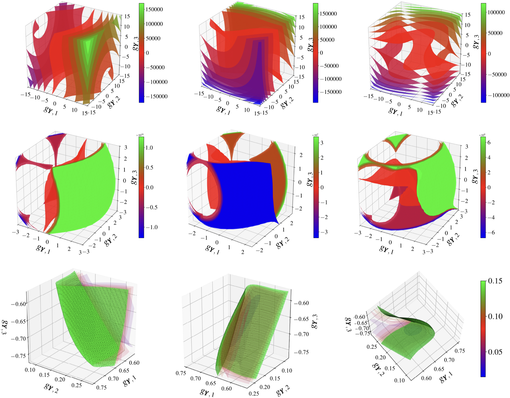
</p>

The reduced problems are still highly nonlinear even after translation elimination. In the contour slices above, the upper row visualizes the pure-translation HERWC equations in the `g_Y` coordinate space, the middle row shows slices of the complete reduced equations, and the lower row shows the squared-norm objective of the complete system. These figures are a geometric explanation of why a globally valid polynomial solver is useful: local linearization can miss the structure of the zero-level intersections.

<p align="center">
  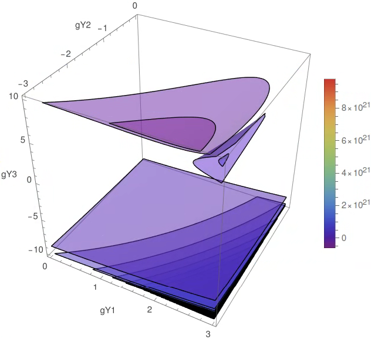
  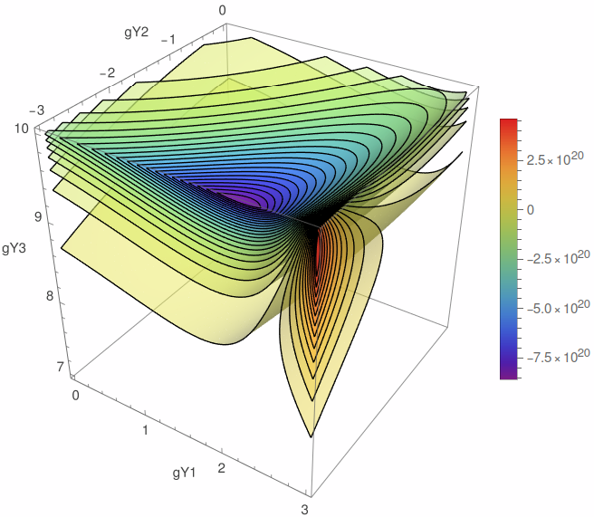
</p>

The zoomed complete-HERWC contours show separated low-value regions and sharp local variation around a root. This matches the paper’s observation that the reduced complete problem remains strongly non-convex even after symbolic elimination, and that coefficient scaling can be severe enough to require careful numerical handling.

<p align="center">
  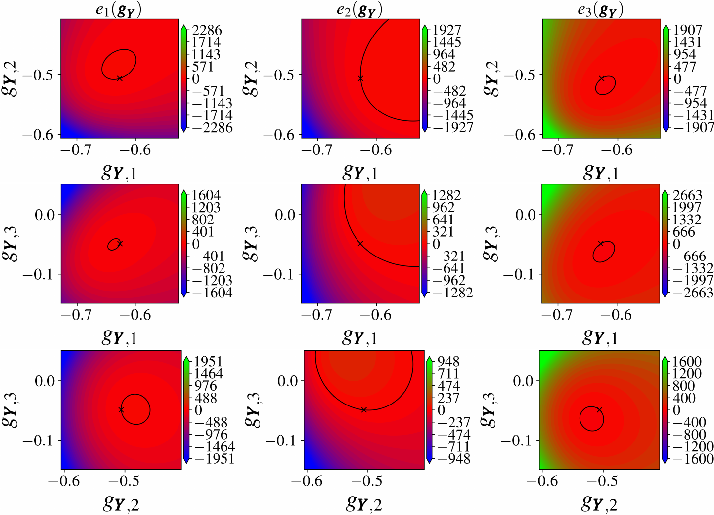
</p>

The same plotting logic extends to the more general `A X B = Y C Z` variant. After eliminating translations and algebraically removing the redundant `Z` rotation, the reduced HERWTFC system still shows anisotropic, root-preserving, and non-convex contour structure. Even though this repository is centered on the `AX=YB` solver path, this figure helps place the AXYB implementation inside the broader minimum-parameter symbolic reduction program described by the paper.


## Build: ARM64 macOS / Clang 16

```bash
cmake -S . -B build \
  -DCMAKE_BUILD_TYPE=Release \
  -DCMAKE_CXX_COMPILER=clang++ \
  -DCMAKE_OSX_ARCHITECTURES=arm64 \
  -DAXYB_USE_BUNDLED_TBB=ON

cmake --build build -j
```

The CMake project applies the requested `-w -O3` compile options project-wide and also passes those options to the bundled `oneTBB-2019_U9` build.  On macOS, the dense BLAS/LAPACK path links against Apple Accelerate.

If you already have TBB installed and prefer not to build the bundled source:

```bash
cmake -S . -B build -DCMAKE_BUILD_TYPE=Release -DAXYB_USE_BUNDLED_TBB=OFF
cmake --build build -j
```

## Run

```bash
./build/test_AXYB_grobner_solver --backend tbb-pcg --threads 8 --seed 2345789
./build/test_AXYB_grobner_solver_loop --backend tbb-pcg --threads 8 --iters 10 --seed 2345789
./build/test_AXYB_grobner_solver_loop --backend tbb-pcg --threads 8 --iters 10 --seed 2345789 --output_meas loop_meas.txt
./build/test_AXYB_grobner_solver_loop --backend tbb-pcg --threads 8 --input_meas loop_meas.txt
./build/benchmark_AXYB_linear_backends --template x1-x3 --repeats 3 --threads 8 --seed 2345789
./build/run_rw_multi_eye_multi_hand --backend lapack-gesv --retry_tol 1e-3 --tag 0 --camera 0
```

The build step copies `data/templates` next to each executable, and the binaries automatically look in that sibling `templates` directory by default.  You can also point the executable to a template directory explicitly:

```bash
./build/test_AXYB_grobner_solver --data-dir ./data/templates
./build/test_AXYB_grobner_solver --data-dir ./data/templates --template x3
./build/test_AXYB_grobner_solver --data-dir ./data/templates --templates 2-4
```

or set:

```bash
export AXYB_TEMPLATE_DIR=/path/to/data/templates
```

## Command-line options

```text
--backend NAME       Linear-system backend selector
--data-dir DIR       Directory containing AXYB_complete_x*.tpl templates; default is executable_dir/templates
--template SEL       Use one template or inclusive range: x3, 3, x2-x4, or 2-4
--templates A-B      Alias for inclusive template range selection
--threads N          Limit oneTBB worker parallelism
--len N              Number of random motion pairs, default 5
--noise X            Synthetic noise level, default 5e-2
--mu X               Tikhonov/normal-equation regularization, default 5e-9
--retry_tol X        Retry other backends if objective > X
--seed N             Reproducible RNG seed
--pcg-tol X          PCG tolerance, default 1e-8
--pcg-maxit N        PCG iteration limit, default 300
--prescale X         Multiply assembled C0 and C1 template matrices, default 1
--asymmetric         Solve C0 * x = C1t directly; defaults to lapack-gesv
--verbose            Print dense solve determinant diagnostics
--no-fallback        Disable dense direct fallback for iterative methods
--no-template-parallel Disable oneTBB parallel execution across selected templates
--no-backend-parallel Disable oneTBB parallel execution across retry backends
--output_meas PATH   Loop executable only; write generated measurement sequences
--input_meas PATH    Loop executable only; read generated measurement sequences
--iters N            Loop executable only; default 1000
--help
```

Without `--template` or `--templates`, the solver runs all six templates and keeps the best solution.  With either option, it runs only the selected inclusive subset and keeps the best solution from that subset.

For `test_AXYB_grobner_solver_loop`, `--output_meas PATH` writes every generated synthetic problem in loop order to one text file. `--input_meas PATH` replays every stored problem from one such file instead of generating new random data; in that mode `--iters`, `--len`, `--noise`, and `--seed` are ignored.

If `--retry_tol X` is set and the chosen backend returns an objective larger than `X`, the solver reruns the full solve with additional backends. By default those retry backends are evaluated concurrently with oneTBB, but selection still follows this order: the first backend in the list whose objective is at most `X` is chosen; if none reach the tolerance, the best objective across all attempted backends is returned. Use `--no-backend-parallel` to force serial retry. The new SVD-style LAPACK backends are intentionally not part of this automatic retry list because they are substantially more expensive than the default retry set.

```text
lapack-gesv, tbb-block-jacobi, eigen-llt, eigen-partial-piv-lu, eigen-ldlt, eigen-sparse-lu, tbb-pcg
```

## Linear backend benchmark

`benchmark_AXYB_linear_backends` prepares the Gröbner template systems once from a synthetic AXYB problem, then times `solve_template_system()` for each backend on the same inputs.  This isolates the linear solver path more than benchmarking the full Gröbner pipeline.

Useful benchmark-specific options:

```text
--repeats N          Timed passes per backend, default 3
--warmup N           Untimed passes per backend, default 1
```

All common data-generation and template-selection options still apply, including `--data-dir`, `--template`, `--templates`, `--len`, `--noise`, `--mu`, `--seed`, `--threads`, `--pcg-tol`, `--pcg-maxit`, `--prescale`, `--asymmetric`, and `--no-fallback`. `--retry_tol`, `--no-template-parallel`, and `--no-backend-parallel` are solver-only and are not used by the linear benchmark.

## Real-world RWHE Processing

`run_rw_multi_eye_multi_hand` walks `certifiable-rwhe-calibration/data/real-world/combined`, loads every matched `tag_*_cam_*_{A,B}.csv` pair, solves each tag/camera pair with the current AXYB solver, and then aggregates one pose per tag and one pose per camera using measurement-count weighted averaging plus rotation re-orthonormalization.

Extra options for this executable:

```text
--measurement-dir DIR  Directory containing tag_*_cam_*_{A,B}.csv files
--min-measurements N   Skip pairs with fewer than N rows; default 3
--tag ID               Process only one tag id
--camera ID            Process only one camera id
```

The solver-related CLI options are copied over from the existing binaries and apply to each per-pair solve. `--len`, `--noise`, and `--seed` are accepted for compatibility but are not used by this real-data executable.

## Linear-system backends

The solver forms the regularized normal system

```text
(scale * C0' * C0 + mu * I) * X = scale * C0' * C1
```

for each Gröbner template.  Available backend names are:

| Backend selector | Implementation |
| --- | --- |
| `tbb-pcg`, `pcg`, `parallel-pcg` | oneTBB-parallel preconditioned conjugate gradients; block preconditioner uses LAPACK Cholesky/LU by template blocks |
| `tbb-block-jacobi`, `block-backslash`, `backslash` | oneTBB-parallel block-Jacobi/backslash-style iteration with dense fallback |
| `lapack-posv`, `dense-cholesky`, `matlab_backslash`, `direct`, `accelerate`, `blas-cholesky` | Dense normal matrix plus LAPACK/Accelerate `dposv` Cholesky driver |
| `lapack-gesv`, `dense-lu`, `blas-lu` | Dense normal matrix plus LAPACK/Accelerate `dgesv` LU driver |
| `lapack-llt`, `lapack-potrf`, `lapack-potrs` | Dense normal matrix plus explicit LAPACK `dpotrf`/`dpotrs` LLT factorization and solve |
| `lapack-partial-piv-lu`, `lapack-getrf`, `lapack-getrs` | Dense system plus explicit LAPACK `dgetrf`/`dgetrs` partial-pivot LU |
| `lapack-ldlt`, `lapack-sysv` | Dense normal matrix plus LAPACK `dsysv` symmetric-indefinite LDLT solve |
| `lapack-pinv`, `lapack-pseudoinverse` | Dense system plus LAPACK `dgesvd` pseudoinverse solve |
| `lapack-svd` | Dense system plus LAPACK `dgesvd` direct SVD solve |
| `eigen-llt`, `eigen-ldlt`, `eigen-partial-piv-lu`, `eigen-sparse-lu` | Optional Eigen interfaces enabled when CMake finds Eigen3 |

The default backend is `tbb-pcg`, which avoids explicitly factorizing the largest dense normal matrices. The dense LAPACK/Accelerate modes are useful for validation and MATLAB-like behavior, but the largest template has 6991 unknowns, so direct dense solves can require substantial memory. `lapack-pinv` and `lapack-svd` are the heaviest options by a wide margin because they run full dense SVD on the template system.

## Parallel processing

The C++ implementation uses oneTBB in four places:

1. independent RHS solves inside each action-template linear system;
2. template block factorization / block preconditioner work;
3. automatic parallel execution across the selected action templates.
4. automatic parallel execution across retry backends once `--retry_tol` triggers additional solves.

Use `--threads N` to limit oneTBB worker count at runtime. Use `--no-template-parallel` or `--no-backend-parallel` if you need to force serial execution at either level.
Use `--prescale X` to multiply the assembled `C0` and `C1` template matrices before `BB` construction and the downstream linear solve.
Use `--asymmetric` to bypass the normal equations and solve `C0 * x = C1t` directly. If no backend is specified, this mode defaults to `lapack-gesv`.
Use `--verbose` to enable the `dense solve determinants:` block; without it, those determinant diagnostics are neither computed nor printed.

## Regenerating the converted template files

`tools/generate_from_matlab.py` is included for traceability.  It was used to translate the sparse Gröbner templates into:

- `src/generated_symbolics.cpp`
- `include/axyb/generated_symbolics.hpp`
- `data/templates/AXYB_complete_x1.tpl` ... `AXYB_complete_x6.tpl`

The packaged project already contains those generated outputs, so regeneration is not part of the normal build.

## Notes

- The project targets C++17.
- On macOS ARM64 Clang, use `-DCMAKE_OSX_ARCHITECTURES=arm64`; CMake defaults to `arm64` on Apple when not otherwise specified.

## References
1. **Wu, J.**, et al. (2026)
   Minimum-Parameter Symbolic Patterns of Hand-Eye Calibration Variants: Analysis and Efficient Solvers, ***Submitted to International Journal of Robotics Research***,
2. **Wise, E.**, et al. (2026)
   A certifiably correct algorithm for generalized robot-world and hand-eye calibration, ***International Journal of Robotics Research***
